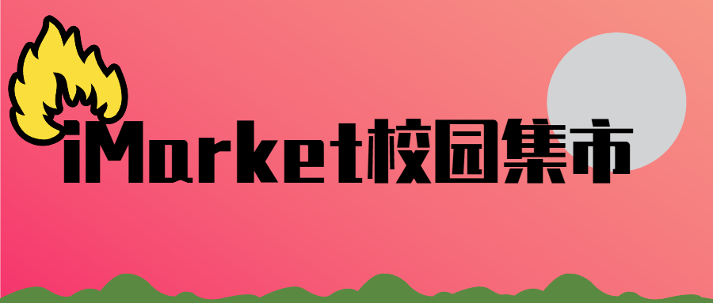

<center>



# iMarket 校园集市后端  

<div align="center">
  
  
  
  
</div>

</center>

---

## 🌟 项目亮点

🚀 **全栈解决方案** · 📱 **移动优先设计** · 🛡️ **JWT安全认证**  · 🔌 **插件式扩展** 

<div align="center">
  <a href="https://imarket.jeanhua.cn/"></a>
  <a href="https://github.com/jeanhua/imarket-page"></a>
</div>


---

## 🛠️ 技术栈全景

<table>
  <tr>
    <td width="33%">
      <div align="center">
        
        <br><strong>C# 12</strong>
        <br>现代化语法特性
      </div>
    </td>
    <td width="33%">
      <div align="center">
        
        <br><strong>ASP.NET Core 8</strong>
        <br>高性能Web框架
      </div>
    </td>
    <td width="33%">
      <div align="center">
        
        <br><strong>Docker</strong>
        <br>容器化部署方案
      </div>
    </td>
  </tr>
</table>


---

## 📚 核心功能

<details>
<summary><strong>📦 核心模块</strong></summary>
• **用户系统** 👥  
  ✅ 实名认证 · ✅ 角色权限管理

• **内容管理** 📝 
  🔍 帖子搜索 · 🏷️ 帖子分类 · 🔞 敏感词过滤

• **用户模块** 💰  
  🛒 收藏夹 · 💬 私信系统

</details>

---

## 🚀 快速开始

```bash
# 克隆项目
git clone https://github.com/jeanhua/imarket-backend.git

# 安装依赖
dotnet restore

# 配置数据库（修改appsettings.json）
{
    "ConnectionStrings": {
        "DefaultConnection": "Server=localhost;Database=imarket;User Id=imarket_root;Password=your_password;"
    }
}

# 运行项目
dotnet run
```

---

## 📄 文档体系

| 文档类型   | 访问方式                                                     |
| ---------- | ------------------------------------------------------------ |
| 📘 API 文档 | [在线浏览](https://jeanhuas-organization.gitbook.io/imarket) |
| 📗 部署指南 | [快速开始](https://jeanhuas-organization.gitbook.io/imarket/getting-started/quickstart) |
| 📙 架构设计 | [简介](https://jeanhuas-organization.gitbook.io/imarket/introduce-jian-jie) |
| 📒 插件开发 | [快速上手](https://jeanhuas-organization.gitbook.io/imarket/plugin/start-kuai-su-shang-shou) |

---

## 🤝 贡献之路

欢迎通过以下方式参与贡献：  
🔧 **代码开发** · 📝 **文档完善** · 🐛 **问题反馈**  
🎨 **UI设计** · 🌍 **多语言支持** · 🧪 **测试优化**

**贡献流程**：
1. Fork 仓库并创建分支 `git checkout -b feat/amazing-feature`
2. 提交代码 `git commit -m '添加炫酷功能'`
3. 推送分支 `git push origin feat/amazing-feature`
4. 发起 Pull Request

---

## 📬 联系我们

<table>
  <tr>
    <td width="50%">
      <div align="center">
        
        <br>
        <strong>作者邮箱</strong>
        <br>
        <a href="mailto:jeanhua_official@outlook.com">jeanhua_official@outlook.com</a>
      </div>
    </td>
    <td width="50%">
      <div align="center">
        
        <br>
        <strong>GitHub仓库</strong>
        <br>
        <a href="https://github.com/jeanhua/imarket-backend">imarket-backend</a>
      </div>
    </td>
  </tr>
</table>


---

<div align="center">
  📜 基于 Apache2 协议开源 · Copyright © Since 2025 Jeanhua
</div>
